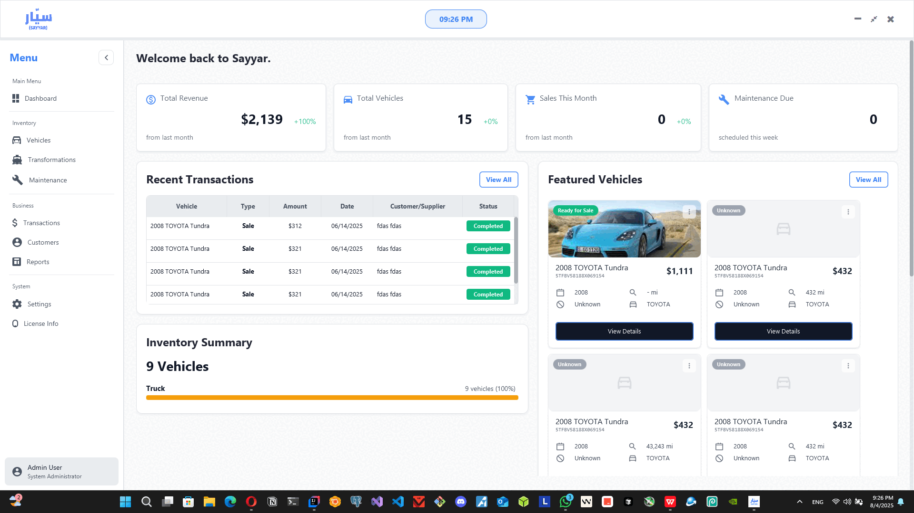

# SAYYAR — Smart Vehicle Management System Showcase

  

> A robust and modern vehicle management desktop system built for businesses that manage fleets, sales, maintenance, and more.
> **Showcase repository only** — source code is private due to future commercialization.

---

## 🔍 Table of Contents

1. [🚗 What is SAYYAR?](#what-is-sayyar)
2. [🔐 Key Features](#key-features)
3. [📈 Live Demonstration](#live-demonstration)
4. [📸 Screenshots](#screenshots)
5. [📊 Workflow Example](#workflow-example)
6. [🛠️ Technical Stack](#technical-stack)
7. [📏 Architecture](#architecture)
8. [👤 Author](#author)
9. [⚠️ Disclaimer](#disclaimer)

---

## 🚗 What is SAYYAR?

**SAYYAR** is a powerful desktop-based vehicle management system designed for automotive businesses, car traders, and fleet managers in Libya and beyond. Built with performance, usability, and operational clarity in mind, it provides an end-to-end solution to manage:

* Inventory
* Maintenance
* Financials
* Analytics
* Customer relationships

It aims to digitize and unify all aspects of business operations in the automotive domain.

---

## 🔐 Key Features

* ✅ **Inventory Management**

  * Add, edit, and track vehicles with metadata (VIN, color, year, images...)
  * Filter, search, and paginate vehicle lists

* 💳 **Transaction Tracking**

  * Purchase, sale, and commission sales linked to customers
  * Full payment lifecycle tracking

* ⚖️ **Maintenance & Transformation Management**

  * Log service records and transformation upgrades/modifications
  * Track history, status, and cost of each operation

* 💼 **Customer Management**

  * Client database with transaction and maintenance history

* 🔢 **Real-Time Analytics**

  * Sales trends, capital, profit margin, vehicle performance metrics

* 🔎 **Data Scraping**

  * Auto-fill vehicle metadata from online auction listings

* ⚙️ **System Configuration & Localization**

  * Language settings, customizable currency/payment methods, dynamic model lists

* 📂 **Backup & Recovery**

  * Manual and scheduled backup features for local database

* 🔒 **Persistence & Reliability**

  * SQLite + Hibernate ORM for data integrity and local resilience

---

## 📈 Live Demonstration

> Coming soon... \[Demo video link here]

---

## 📸 Screenshots

---

## 📊 Workflow Example

**Add Vehicle → Send to Maintenance → Transformation Tracking**

1. **Add a Vehicle**

   * Navigate to Stock → Add Vehicle → Fill metadata → Save

2. **Send to Maintenance**

   * Select vehicle → Send to Maintenance → Log service

3. **Apply Transformation**

   * Modify details → Record cost → Save

Each step is fully tracked and tied to the vehicle’s lifecycle.

---

## 🛠️ Technical Stack

* **Language:** Java 17
* **UI Framework:** JavaFX (FXML + CSS)
* **ORM:** Hibernate (JPA)
* **Database:** SQLite (embedded)
* **Build:** Maven
* **Utilities:** Jsoup, OkHttp, SLF4J, Lombok

---

## 📏 Architecture

* MVC pattern (Model-View-Controller)
* DAO service/repo abstraction
* Modular packages:

  * `model`, `controller`, `services`, `repository`, `util`, `resources`

---

## 👤 Author

**Abdulqadir Aldhalia**
Software Architect | Backend Specialist | Robotics Engineer

📧 [abdulqadir.aldhalia@hotmail.com](mailto:abdulqadir.aldhalia@hotmail.com)
🔗 [GitHub](https://github.com/Abdulqadir-Aldhalia)

---

## ⚠️ Disclaimer

This is a **showcase repository only**. The source code is **private** for privacy, IP protection, and future commercial deployment.

---

*Thank you for exploring SAYYAR. Reach out if you want to collaborate!*
